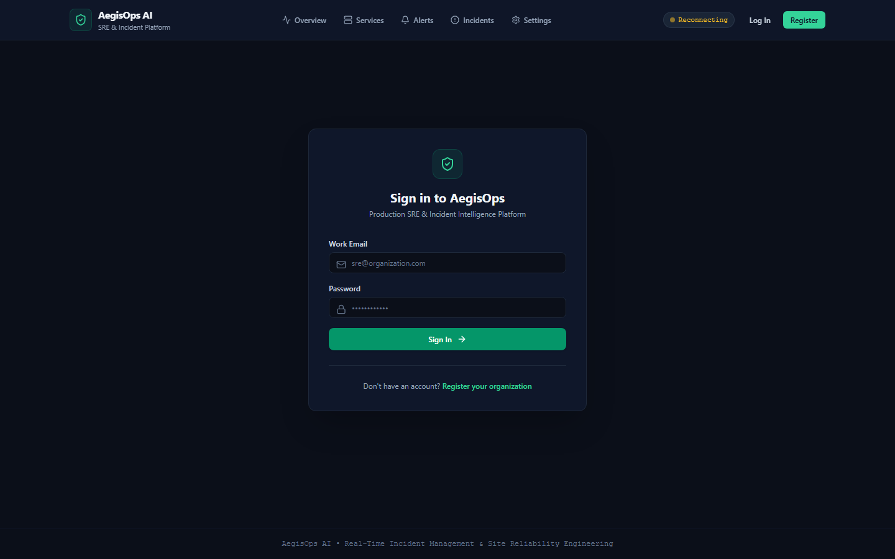
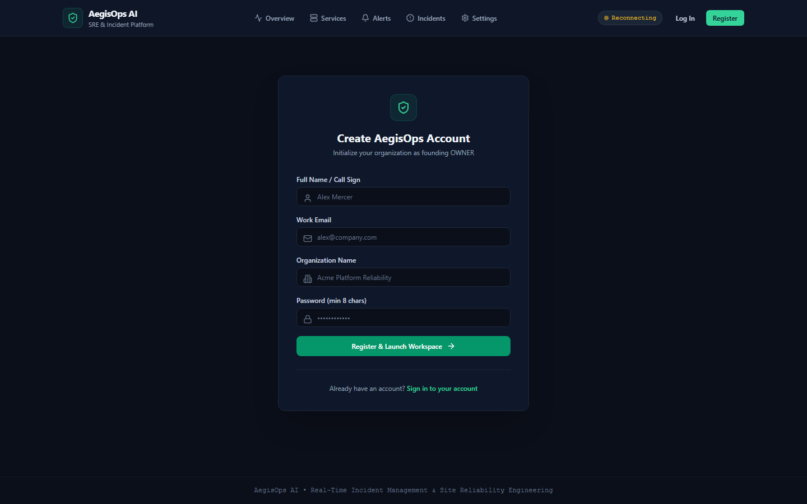
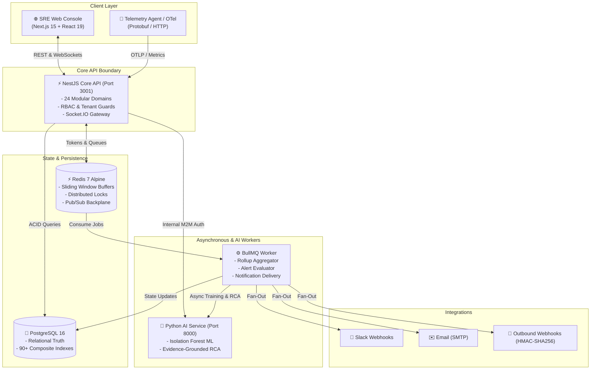

# AegisOps AI

### AI-Powered Incident Management, Observability & Site Reliability Engineering (SRE) Platform

[](https://www.typescriptlang.org/)
[](https://nextjs.org/)
[](https://nestjs.com/)
[](https://python.org/)
[](https://postgresql.org/)
[](https://redis.io/)
[](https://docker.com/)

> **Notice**: This repository is an engineered portfolio project. All demo incidents, telemetry spikes, and company examples are **synthetic demonstration scenarios** designed to illustrate SRE and incident workflows.

---

## 1. Executive Summary

**AegisOps AI** is a production-grade Site Reliability Engineering (SRE) and incident response platform. In modern microservice architectures, when an infrastructure failure or performance regression occurs, engineering teams are inundated with thousands of raw metric samples, trace spans, and cascading alert storms across distributed services.

AegisOps AI automates the complete operational lifecycle:
$$\text{Observe} \longrightarrow \text{Detect} \longrightarrow \text{Correlate} \longrightarrow \text{Triage} \longrightarrow \text{Investigate} \longrightarrow \text{Resolve} \longrightarrow \text{Learn}$$

By combining deterministic sliding-window alert rules with unsupervised machine learning (**Isolation Forest**) and topological dependency graph (**DAG**) correlation, AegisOps reduces operational alert fatigue and enables evidence-grounded incident resolution.

---

## 2. Visual Interface & Screenshots

| SRE Authentication & Control Plane | Multi-Tenant Workspace Registration |
| :---: | :---: |
|  |  |

*Additional component layouts and ASCII architectural wireframes are documented in [docs/screenshots/README.md](docs/screenshots/README.md).*

---

## 3. System Architecture

The platform follows a disciplined **Modular Monolith** pattern in **NestJS 10** for business logic, while isolating compute-heavy scientific machine learning workloads behind a dedicated **Python FastAPI** microservice boundary:



---

## 4. The Incident Engineering Lifecycle

AegisOps AI closes the loop from initial metric anomaly to approved postmortem action items:

```mermaid
flowchart LR
    M["📡 Telemetry<br/>(OTLP Stream)"] --> A["🚨 Alert Rule<br/>(Sliding Window)"]
    A --> C["🔗 Topological<br/>Correlation"]
    C --> I["🔥 Incident<br/>(Command State)"]
    I --> R["🧠 AI RCA<br/>(Evidence Bounded)"]
    R --> H["👤 Human Confirmation<br/>(SRE Sign-Off)"]
    H --> RB["📋 Runbook<br/>(Step Verification)"]
    RB --> S["✅ Resolution<br/>(Incident Cleared)"]
    S --> MET["📊 Reliability<br/>(MTTA / MTTR)"]
    MET --> PM["📝 Postmortem<br/>(Action Items)"]
```



---

## 5. Key Feature Groups

| Capability Group | Key Technical Features |
| :--- | :--- |
| **Observability & Telemetry** | OpenTelemetry (`OTLP/HTTP`) metric ingestion supporting Protobuf & JSON, Redis sliding-window hot buffers, 1-minute rollups (`min`, `max`, `avg`, `p50`, `p90`, `p99`), and cardinality capping (5,000 distinct series per environment). |
| **Service Catalog & Topology** | Service registry with tiers (`TIER_1` to `TIER_3`), multi-environment mapping (`Production`, `Staging`), and directed dependency DAG with transactional in-memory BFS cycle detection. |
| **Synthetic Health Probes** | Active HTTP `GET`/`HEAD` probes with multi-threshold hysteresis state machines (`consecutiveSuccesses`, `consecutiveFailures`) and SSRF protection boundaries. |
| **Alert Engine & Deduplication** | Pure mathematical comparison evaluators, multi-series modes (`PER_SERIES` & `AGGREGATE_SERIES`), deterministic SHA-256 fingerprint deduplication, and Redis distributed locking. |
| **Incident Command Console** | Multi-responder incident rooms, automated severity escalation, audit timeline tracking, and live WebSocket push updates. |
| **Evidence-Grounded AI RCA** | Bounded hypothesis generation isolated in Python FastAPI; evaluates structured evidence packages with unsupported conclusions reduced through empirical bounding. |
| **Operational Runbooks** | Interactive step-by-step checklists (`CHECK`, `MANUAL_ACTION`, `VALIDATION`), execution tracking, and automated runbook recommendations based on failure fingerprints. |
| **ML Anomaly Detection** | Unsupervised Isolation Forest model training, rolling feature extraction (`mean`, `p99`, `rate`, `variance`), model versioning (`AnomalyModelVersion`), artifact hashing, and backtesting. |
| **Notifications & Integrations** | Multi-channel delivery engine (Slack, Webhooks, Email) with HMAC-SHA256 signatures, AES-256-GCM secret encryption, and exponential backoff retry policies. |
| **SRE Reliability Analytics** | Automated calculation of Mean Time to Acknowledge (MTTA), Mean Time to Investigate (MTTI), and Mean Time to Resolve (MTTR) across 30-day sliding windows. |
| **Postmortems & Action Items** | Markdown postmortem generation, chronological incident timeline compilation, lessons learned synthesis, immutable revision history, and assignable action item tracking. |
| **Security & Multi-Tenancy** | Opaque session tokens with Argon2id password hashing, 5-tier RBAC (`OWNER`, `ADMIN`, `SRE`, `ENGINEER`, `VIEWER`), Origin/CSRF verification guards, and SSRF filtering against cloud metadata (`169.254.169.254`). |

---

## 6. AI & Machine Learning Safety Philosophy

### 6.1 Evidence-Grounded AI Root Cause Analysis (RCA)
AegisOps AI constrains AI reasoning by enforcing the **Evidence-Grounding Law**:
* AI hypotheses are strictly constrained by supplied operational evidence (firing alerts, metric spikes, deployment events, and topology edges).
* An `RcaEvidenceBuilder` extracts an immutable evidence package from verified telemetry.
* The Python service evaluates hypotheses strictly against the evidence IDs, reducing unsupported conclusions through structured evidence and counter-evidence.
* **Tri-State Epistemic Segregation**:
  1. **Observed Fact**: Empirically recorded metric points and HTTP error codes.
  2. **AI Hypothesis**: Statistically ranked possibilities with explicit confidence scores.
  3. **Human-Confirmed Root Cause**: The verified cause recorded and signed off by the on-call SRE.
* **Zero Autonomous Destruction**: AI can propose hypotheses and recommend runbooks, but can **never** unilaterally confirm a root cause or modify infrastructure.

### 6.2 Unsupervised Anomaly Detection with Isolation Forest
* **Algorithm**: Isolation Forest isolates anomalies by randomly selecting a feature and split value. Because anomalies require fewer splits to isolate, they appear closer to the root of decision trees.
* **Feature Schema**: Rolling 5-minute windows extract 4 statistical features: `mean`, `p99_latency`, `rate_per_sec`, and `variance`.
* **Important SRE Principle**: The Anomaly Score ($0.0$ to $1.0$) represents mathematical divergence from normal distribution—it is **NOT** an outage probability.

---

## 7. Verification & Automated Test Coverage

AegisOps AI maintains a comprehensive, zero-flake test suite across TypeScript, Python, and browser automation:

| Test Suite | Scope | Verified Result |
| :--- | :--- | :--- |
| **NestJS API Unit & Integration** | Jest (Auth, Telemetry, Alerts, Incidents, Runbooks, RBAC) | **219 / 219 PASSED (32 Suites)** ✅ |
| **Python AI & ML Engine** | Pytest (Isolation Forest, Anomaly Scoring, RCA Hypotheses) | **15 / 15 PASSED** ✅ |
| **Browser E2E & Accessibility** | Playwright Chromium & Axe-core a11y (`apps/web/e2e`) | **7 / 7 PASSED** ✅ |
| **Tenant Isolation & Security Matrix** | Standalone security audit suite (`scratch/test-tenant-and-rbac.mjs`) | **18 / 18 PASSED** ✅ |
| **Dependency Security Audit** | `pnpm audit --audit-level=high` | **0 High-Severity CVEs** ✅ |
| **Prisma Schema Validation** | `pnpm db:validate` | **Synchronized & Validated** ✅ |

---

## 8. Performance & Concurrency Benchmarks

*All benchmarks measured in local environment with PostgreSQL 16 and Redis 7:*

| Endpoint / Operation | Average Latency | P95 Latency | Benchmark Condition |
| :--- | :--- | :--- | :--- |
| `GET /api/health` | **13ms** | **15ms** | Health check probe |
| `GET /v1/auth/me` | **26ms** | **82ms** | Authenticated session check |
| `GET /v1/organizations/:id/services` | **33ms** | **49ms** | Full service catalog with environments |
| `GET /v1/organizations/:id/incidents` | **34ms** | **61ms** | Incident list with responder counts |
| `GET /v1/organizations/:id/alerts` | **27ms** | **40ms** | Active alert episodes |
| `GET /v1/organizations/:id/reliability/summary` | **56ms** | **95ms** | MTTA/MTTR 30-day rollups |
| **Concurrent Load Throughput** | — | — | **25 parallel requests in 578ms total wall time** |

---

## 9. Quick Start: Local Development

### 9.1 Prerequisites
* **Node.js**: v20.x or v22.x LTS
* **pnpm**: v12.x (`npm install -g pnpm`)
* **Python**: v3.11 or v3.12 with `pip`
* **Docker & Docker Compose**: For local PostgreSQL 16 and Redis 7

### 9.2 Setup & Service Startup
```bash
# 1. Clone repository
git clone https://github.com/zeeshansajid8505-sys/aegisops-ai.git
cd aegisops-ai

# 2. Copy environment configuration template
cp .env.example .env

# 3. Install Node.js dependencies
pnpm install

# 4. Setup Python virtual environment for the AI service
cd apps/ai-service
python -m venv .venv
# On Windows:
.venv\Scripts\activate
# On Linux/macOS:
source .venv/bin/activate
pip install -r requirements.txt
cd ../..

# 5. Start PostgreSQL and Redis containers
docker compose -f infrastructure/docker/docker-compose.yml up -d

# 6. Apply database schema & seed realistic demo data
pnpm db:validate
pnpm db:generate
# (Optional) Seed demo org with an existing user:
# DEMO_OWNER_EMAIL=sre@organization.com pnpm demo:seed

# 7. Start all applications in development mode
pnpm dev
```

### 9.3 Service Endpoints
| Component | Local URL | Description |
| :--- | :--- | :--- |
| **Web Console** | `http://localhost:3000` | Next.js SRE operational web interface |
| **Core API** | `http://localhost:3001/api` | NestJS Core Business API |
| **Swagger UI** | `http://localhost:3001/api/docs` | Interactive OpenAPI documentation |
| **FastAPI AI** | `http://localhost:8000` | Python Anomaly Detection & RCA service |
| **AI Docs** | `http://localhost:8000/docs` | FastAPI Swagger documentation |

---

## 10. Genuine Technical Limitations

To maintain architectural transparency and engineering honesty:
1. **Single-Region Deployment**: Current architecture targets single-region cloud deployments. Multi-region active-active failover would require geo-distributed database clustering (CockroachDB or AWS Aurora Global Database).
2. **Synthetic Telemetry Agent**: The included telemetry simulation agent generates deterministic synthetic workloads. Production deployments ingest real OpenTelemetry traces via OTel Collector pipelines.
3. **Memory Buffering**: High-frequency metric ingestion uses Redis sliding-window sorted sets. For organizations emitting over 100,000 metrics per second, ingest partitioning should be migrated to Apache Kafka or AWS Kinesis.
4. **Interactive Runbook Execution**: Runbook verification steps currently require responder confirmation. Fully automated autonomous remediation is deliberately avoided to maintain human oversight.

---

## 11. Architectural Documentation & Portfolio Resources

Detailed architecture specifications, interview guides, and case studies are available in `/docs`:

* **[Architecture Decision Records (ADRs)](docs/adr/README.md)**: 21 documented architectural decisions (ADR-001 through ADR-021).
* **[System Architecture Specification](docs/architecture/architecture.md)**: Comprehensive container, component, and data flow specification.
* **[Production Deployment Guide](docs/deployment/production-deployment.md)**: Cloud hosting, database migration protocol, and rollback strategies.
* **[Live Demonstration Scripts](docs/demo/demo-script.md)**: 60s, 5m, and 10m walkthroughs.
* **[Technical Interview Defense Guide](docs/portfolio/interview-guide.md)**: Frequently asked system design questions, concurrency trade-offs, and scaling FAQ.
* **[ATS-Optimized Resume Entries](docs/portfolio/cv-entry.md)**: Formatted resume bullets and technology summaries.
* **[Full Architectural Case Study](docs/portfolio/case-study.md)**: In-depth design review, engineering challenges, and key results.

---

## 12. License

No open-source license granted. All rights reserved.
